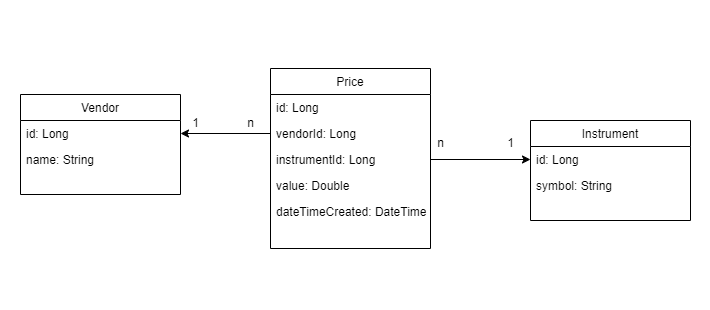
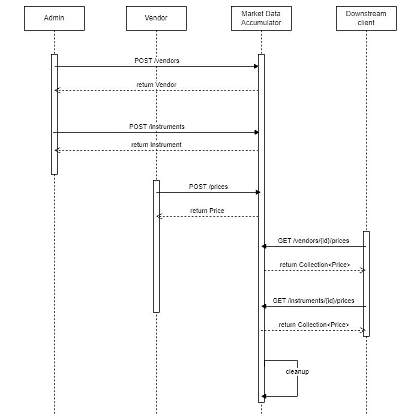

Market Data Accumulator
========================

Market Data Accumulator is a Spring Boot-based Java 17 application designed to handle market price updates for traded instruments.
Application provides a REST API for vendors to push real-time price updates and empowers downstream clients with access to the latest market prices.
It has in-memory price update cache with automated data cleanup.

## Technology stack
Spring Boot lets us kick-start an application in minutes and the underlying Spring framework has all the tools necessary to implement, document and test a REST API with ease.
Further evolution of the application would probably include implementing authentication & authorization, data validation, persistent storage of data, etc.
Spring has the tools to cover these areas.

## Design considerations & decisions
1. <b>Vendors pushing data versus us pulling data</b>

Given the requirements it feels right to expose an API for vendors to push the data to. This way we can expect near real-time price updates.
A risk which we need to manage with this approach is that we are not in control of the load (number of requests per time unit) we receive. Solution needs to be scalable and resilient to withstand varying amount of load.

2. <b>Downstream systems pulling the data versus us pushing the data</b>

According to the requirements downstream systems are interested in a collection of prices over a moving window.
There is no emphasis on getting the latest price as soon as possible.
Therefore, I chose to expose a REST API and let the client pull the data when in need.

3. <b>Automated cache cleanup</b>

I considered several options here: Spring Cache Manager vs Spring Scheduler.
Spring managed cache would remove entries based on the date & time it was placed into the cache.
But I wanted the removal to occur based on the DateTime field of the Price record itself.
After consulting with stakeholders I decided to use scheduler.

4. <b>The structure of Price updates repository</b>

The first thought was to place all price updates into a single map and then filter out results per user request.
But then I came up with an idea to create separate nested maps which would group price updates by vendor & instrument.
This can be considered as premature optimization, but I wanted to see it in action.

5. <b>REST API design</b>

Initially I wanted to have all price related endpoints to be under Price Controller but after careful consideration
I moved Prices by Vendor and Prices by Instrument endpoints to Vendor and Instrument Controllers respectively.

## Domain model

## Sequence diagram

## Run the app
>mvn spring-boot:run

or

>java -jar market-data-accumulator-0.0.1-SNAPSHOT.jar

## Run the app in demo mode

In demo mode repositories are populated with random data. Cache cleanup can be seen in action. Traces of cleanup are in the log.

>mvn spring-boot:run -Dspring-boot.run.profiles=demo

or

>java -Dspring.profiles.active=demo -jar market-data-accumulator-0.0.1-SNAPSHOT.jar

